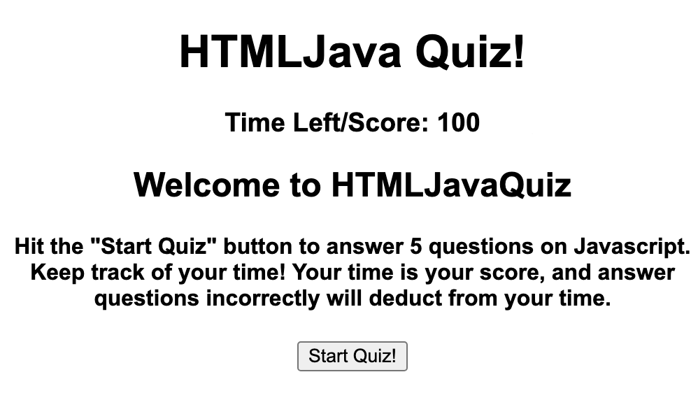
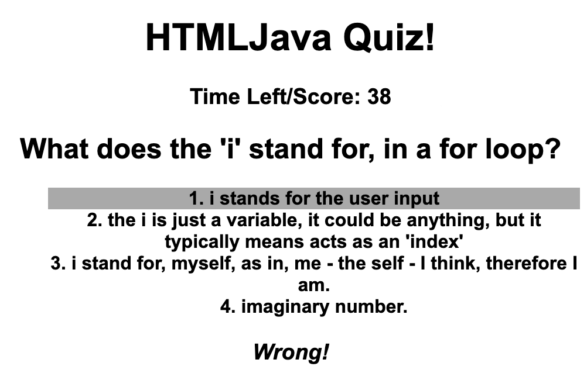
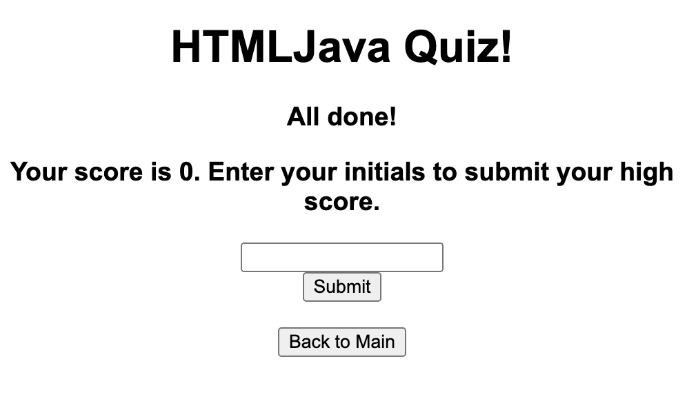
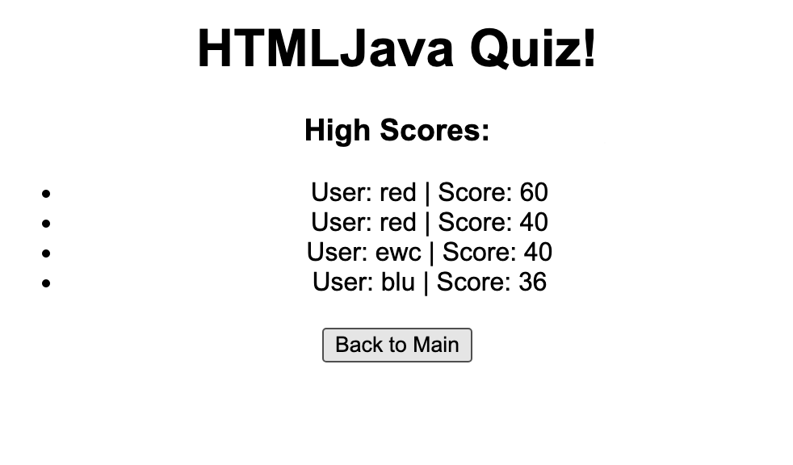

# HTMLJavascript Quiz

* [Overview] (#Overview)
* [Installation] (#Installation)
* [Features] (#Features)
* [License] (#License)

## Overview
This is the full script for a time-based quiz on HTML and Javascript. The main menu is loaded up right away, giving the player the directions and offering the start quiz button. Once it's pushed, a question and several multiple choice answers appear, and the timer begins to countdown. After several questions, the User is asked to input their initials, or go back to the main menu. If they input their initials, they'll be brought tot he high scores page.

## Installation
This HTML file requires a .CSS style sheet and .js file for javascript functionality. By placing the entire website folder on a server together, it can be uploaded to a server, and the files can be found.

## Features
This quiz features 3 questions. The timer starts at 100 seconds, but the player loses 20 seconds for each incorrect answer. If time runs out, or all the questions are answered, the player is brought to the high score screen, where they can enter their initials, or go back to the main menu. If they submit their initials, they'll see a list of other scores, retrieved from the local storage.

 

 

 

 

## License 
Source: choosealicense.com
```
This is free and unencumbered software released into the public domain.

Anyone is free to copy, modify, publish, use, compile, sell, or
distribute this software, either in source code form or as a compiled
binary, for any purpose, commercial or non-commercial, and by any
means.

In jurisdictions that recognize copyright laws, the author or authors
of this software dedicate any and all copyright interest in the
software to the public domain. We make this dedication for the benefit
of the public at large and to the detriment of our heirs and
successors. We intend this dedication to be an overt act of
relinquishment in perpetuity of all present and future rights to this
software under copyright law.

THE SOFTWARE IS PROVIDED "AS IS", WITHOUT WARRANTY OF ANY KIND,
EXPRESS OR IMPLIED, INCLUDING BUT NOT LIMITED TO THE WARRANTIES OF
MERCHANTABILITY, FITNESS FOR A PARTICULAR PURPOSE AND NONINFRINGEMENT.
IN NO EVENT SHALL THE AUTHORS BE LIABLE FOR ANY CLAIM, DAMAGES OR
OTHER LIABILITY, WHETHER IN AN ACTION OF CONTRACT, TORT OR OTHERWISE,
ARISING FROM, OUT OF OR IN CONNECTION WITH THE SOFTWARE OR THE USE OR
OTHER DEALINGS IN THE SOFTWARE.

For more information, please refer to <https://unlicense.org>
```